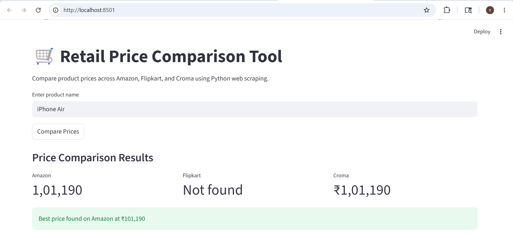
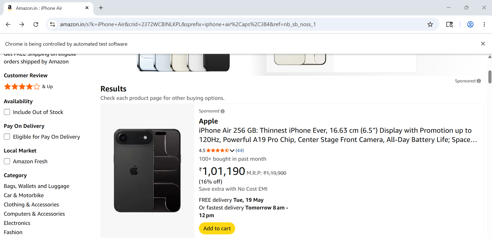

# 🛒 Retail Price Comparison Scraper

A Python-based retail price comparison tool that scrapes product prices from multiple e-commerce platforms including Amazon, Flipkart, and Croma.

Built using Selenium, BeautifulSoup, and Streamlit.

---

## 📸 Application Preview

### Streamlit Dashboard



---

### Live Scraping Workflow



---

## 🚀 Features

- Compare product prices across multiple e-commerce websites
- Automated browser-based scraping using Selenium
- Interactive UI built with Streamlit
- Detects the cheapest available product
- Real-time scraping workflow
- Modular Python project structure
- Automated browser driver management

---

## 🛠️ Tech Stack

- Python
- Selenium
- BeautifulSoup4
- Streamlit
- Pandas
- WebDriver Manager

---

## 📂 Project Structure

```bash
retail-price-comparison-scraper/
├── README.md
├── requirements.txt
├── .gitignore
├── main.py
├── app.py
├── assets/
│   ├── app-ui.png
│   └── scraping-demo.png
└── src/
    ├── __init__.py
    ├── scraper.py
    ├── comparator.py
    └── price_utils.py

▶️ Installation
Clone the repository:

Bash
git clone [https://github.com/ShaiveSharma02/retail-price-comparison-scraper.git](https://github.com/ShaiveSharma02/retail-price-comparison-scraper.git)
cd retail-price-comparison-scraper
Install dependencies:

Bash
pip install -r requirements.txt
▶️ Run Terminal Version
Bash
python main.py
▶️ Run Streamlit Dashboard
Bash
python -m streamlit run app.py
📊 Example Workflow
Enter a product name

Scraper visits supported e-commerce websites

Extracts live product prices

Compares pricing across platforms

Displays the best available deal

⚠️ Disclaimer
E-commerce websites frequently update their HTML structure and may block scraping requests.

This project is intended for educational, research, and portfolio purposes only.

👨‍💻 Author
Shaive Sharma